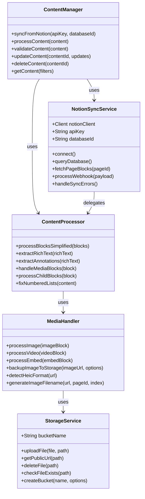
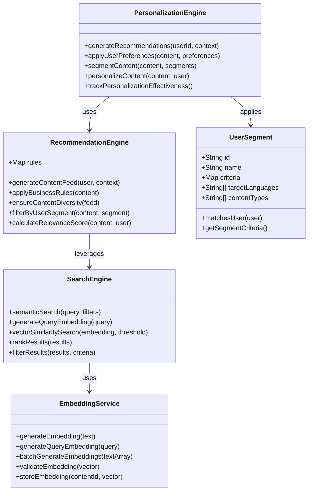
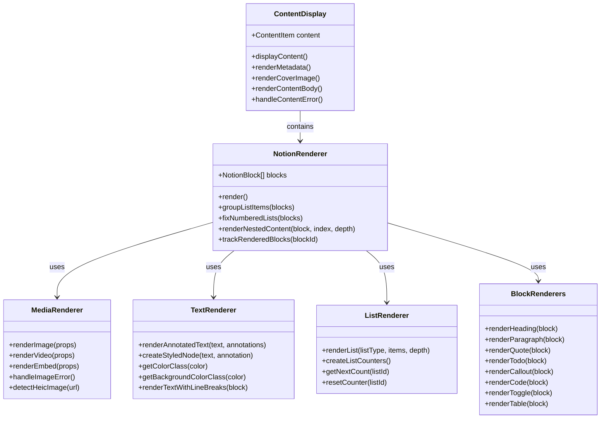
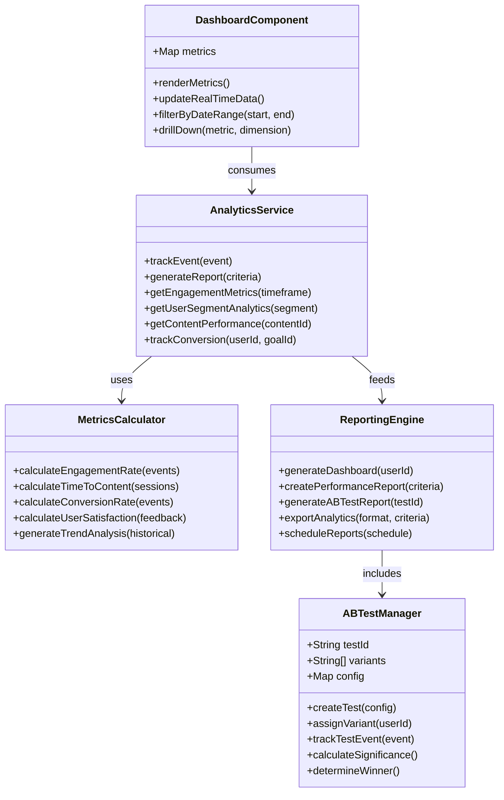
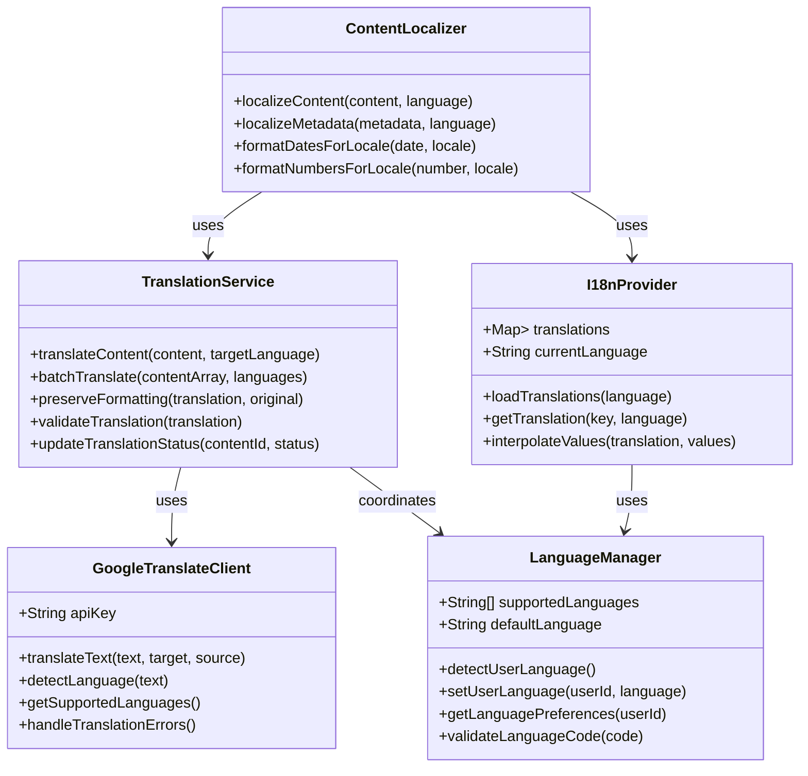
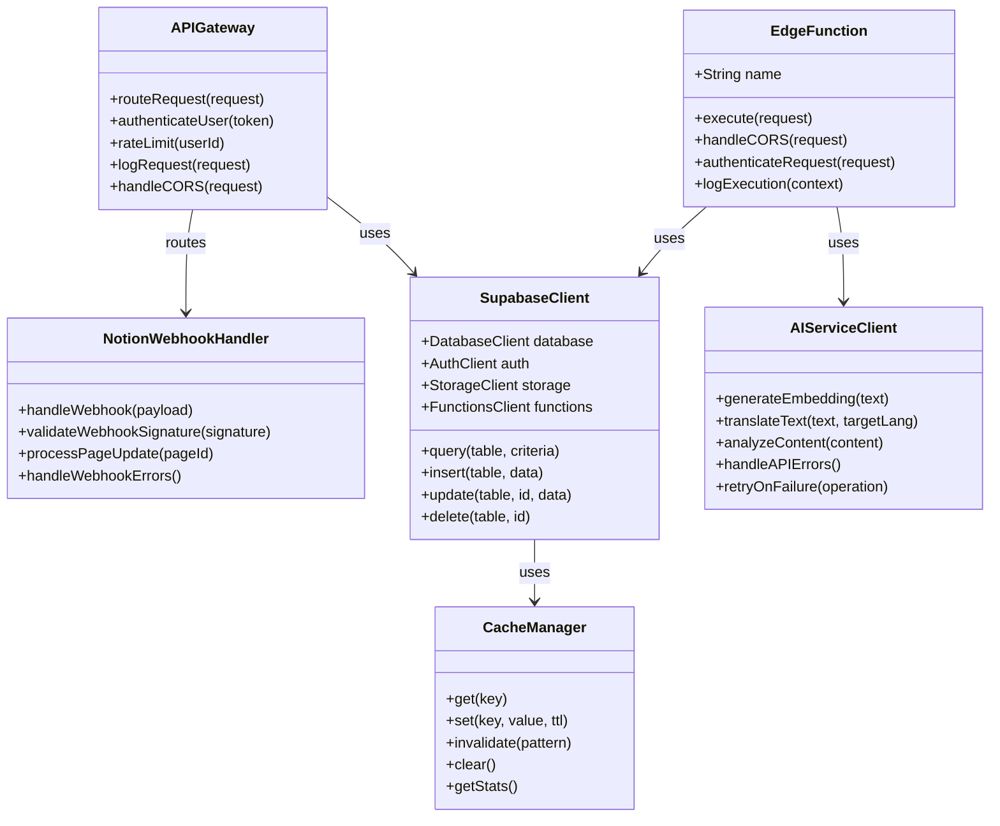

# Vista Platform - Class Diagrams

This document contains comprehensive class diagrams for the Vista platform architecture, supporting the Document-driven Test-driven Development (DTDD) approach.

## 1. Core Domain Models

```mermaid
classDiagram
    class User {
        +UUID id
        +String email
        +DateTime created_at
        +Boolean is_admin
        +String url_param
        +String[] supported_ai_languages
        +String default_language
        +String notion_api_key
        +String notion_database_id
        +authenticate()
        +updatePreferences()
        +getPersonalizationSettings()
    }

    class ContentItem {
        +UUID id
        +String title
        +String description
        +String category
        +String[] tags
        +JSON content
        +DateTime created_at
        +DateTime updated_at
        +Date start_date
        +Date end_date
        +UUID user_id
        +String notion_page_id
        +String notion_url
        +String notion_page_status
        +Vector embedding
        +JSON content_translations
        +JSON description_translations
        +JSON title_translations
        +String cover_image
        +Boolean is_heic_cover
        +String orientation
        +generateEmbedding()
        +translateContent()
        +processNotionBlocks()
        +validateContent()
    }

    class NotionBlock {
        +String type
        +String text
        +NotionAnnotation[] annotations
        +String media_type
        +String media_url
        +String caption
        +Boolean is_heic
        +String orientation
        +NotionBlock[] children
        +Boolean is_list_item
        +String list_type
        +Boolean checked
        +String language
        +Object icon
        +render()
        +processChildren()
        +extractText()
    }

    class NotionAnnotation {
        +String text
        +Integer start
        +Integer end
        +Boolean bold
        +Boolean italic
        +Boolean underline
        +Boolean strikethrough
        +Boolean code
        +String color
        +String href
        +applyFormatting()
        +validateRange()
    }

    class Analytics {
        +UUID id
        +String event_type
        +UUID content_id
        +UUID user_id
        +DateTime timestamp
        +JSON metadata
        +String session_id
        +track()
        +aggregate()
        +generateReport()
    }

    User ||--o{ ContentItem : owns
    ContentItem ||--o{ NotionBlock : contains
    NotionBlock ||--o{ NotionAnnotation : has
    ContentItem ||--o{ Analytics : generates
    User ||--o{ Analytics : performs
```

## 2. Content Management System Architecture



## 3. Search and Personalization Engine



## 4. User Interface and Component Architecture



## 5. Analytics and Reporting System



## 6. Translation and Internationalization



## 7. System Integration and External Services



## Key Architectural Principles

### Separation of Concerns
- **Domain Layer**: Core business logic and entities
- **Service Layer**: Application services and orchestration
- **Infrastructure Layer**: External integrations and persistence
- **Presentation Layer**: UI components and user interactions

### Dependency Injection
- Services depend on abstractions, not concrete implementations
- Easy testing and mocking of external dependencies
- Flexible configuration for different environments

### Error Handling Strategy
- **Graceful Degradation**: System continues to function with reduced capabilities
- **Circuit Breaker Pattern**: Prevents cascading failures
- **Retry Logic**: Automatic retry for transient failures
- **Fallback Mechanisms**: Alternative responses when services are unavailable

### Data Flow Patterns
- **Command Query Responsibility Segregation (CQRS)**: Separate read and write operations
- **Event-Driven Architecture**: Loose coupling between components
- **Repository Pattern**: Abstraction layer for data access
- **Observer Pattern**: Real-time updates and notifications

### Scalability Considerations
- **Horizontal Scaling**: Multiple instances of services
- **Database Optimization**: Proper indexing and query optimization
- **Caching Strategy**: Multi-level caching for performance
- **Async Processing**: Non-blocking operations for better throughput

### Security Measures
- **Authentication and Authorization**: JWT-based security
- **Input Validation**: Comprehensive validation at all entry points
- **Data Encryption**: Encryption at rest and in transit
- **API Rate Limiting**: Protection against abuse and overuse
