# Vista Platform - Class Diagrams

This document provides comprehensive class diagrams for the Vista platform, supporting the Document-driven Test-driven Development (DTDD) approach.

## 1. Core Domain Models

## 2. Frontend Component Architecture

```mermaid
classDiagram
    class App {
        +render(): JSX.Element
    }

    class Router {
        +routes: Route[]
        +renderRoutes(): JSX.Element
    }

    class AuthGuard {
        +children: ReactNode
        +redirectTo: string
        +checkAuth(): boolean
        +render(): JSX.Element
    }

    class AdminGuard {
        +children: ReactNode
        +redirectTo: string
        +checkAdminStatus(): boolean
        +render(): JSX.Element
    }

    class PublicRoute {
        +children: ReactNode
        +render(): JSX.Element
    }

    class AdminLayout {
        +children: ReactNode
        +collapsed: boolean
        +toggleSidebar(): void
        +handleLogout(): void
        +render(): JSX.Element
    }

    class ContentDisplay {
        +contentId: string
        +language: string
        +loadContent(): void
        +render(): JSX.Element
    }

    class ContentBody {
        +content: ContentItem
        +language: string
        +render(): JSX.Element
    }

    class ContentMetadata {
        +content: ContentItem
        +showCategory: boolean
        +showDate: boolean
        +formatDate(date: Date): string
        +render(): JSX.Element
    }

    class ContentCoverImage {
        +content: ContentItem
        +aspectRatio: number
        +priority: boolean
        +render(): JSX.Element
    }

    class NotionRenderer {
        +blocks: Block[]
        +renderBlock(block: Block): JSX.Element
        +groupListItems(blocks: Block[]): Block[]
        +fixNumberedLists(blocks: Block[]): Block[]
        +render(): JSX.Element
    }

    class MediaRenderer {
        +block: MediaBlock
        +handleImageError(): void
        +render(): JSX.Element
    }

    class ListRenderer {
        +items: ListItem[]
        +listType: string
        +renderItems(): JSX.Element
    }

    class PurposeInput {
        +onSubmit: Function
        +placeholder: string
        +defaultValue: string
        +handleSubmit(): void
        +render(): JSX.Element
    }

    class LanguageSwitcher {
        +languages: string[]
        +currentLanguage: string
        +onLanguageChange: Function
        +render(): JSX.Element
    }

    class TranslatedText {
        +children: ReactNode
        +keyword: string
        +className: string
        +translate(): Promise<string>
        +render(): JSX.Element
    }

    class WebhookDebugger {
        +webhookEvents: WebhookEvent[]
        +loadEvents(): void
        +refreshEvents(): void
        +render(): JSX.Element
    }

    class ContentPreview {
        +content: ContentItem[]
        +searchQuery: string
        +currentLanguage: string
        +loadContent(): void
        +handleSearch(): void
        +render(): JSX.Element
    }

    class StyleEditor {
        +selectedTemplate: StyleTemplate
        +customStyles: JsonB
        +previewMode: boolean
        +applyTemplate(template: StyleTemplate): void
        +updateCustomStyles(styles: JsonB): void
        +generatePreview(): void
        +render(): JSX.Element
    }

    class WebsiteEditor {
        +websiteSettings: WebsiteSettings
        +isEditing: boolean
        +pendingChanges: JsonB
        +saveSettings(): void
        +resetChanges(): void
        +previewChanges(): void
        +render(): JSX.Element
    }

    App *-- Router
    Router *-- AuthGuard
    Router *-- AdminGuard
    Router *-- PublicRoute
    AdminGuard *-- AdminLayout
    Router *-- ContentDisplay
    ContentDisplay *-- ContentBody
    ContentDisplay *-- ContentMetadata
    ContentDisplay *-- ContentCoverImage
    ContentBody *-- NotionRenderer
    NotionRenderer *-- MediaRenderer
    NotionRenderer *-- ListRenderer
    AdminLayout *-- PurposeInput
    AdminLayout *-- LanguageSwitcher
    AdminLayout *-- TranslatedText
    AdminLayout *-- WebhookDebugger
    AdminLayout *-- ContentPreview
    AdminLayout *-- StyleEditor
    AdminLayout *-- WebsiteEditor
```

## 3. Backend Service Architecture

## 4. Edge Function Architecture

## 5. Authentication and Authorization Flow

## 6. Testing Architecture

These class diagrams provide a comprehensive view of the Vista platform architecture, including the new website customization features, updated authentication flows, testing infrastructure, and webhook verification system. They serve as a foundation for the Document-driven Test-driven Development (DTDD) approach, guiding implementation and testing efforts.
