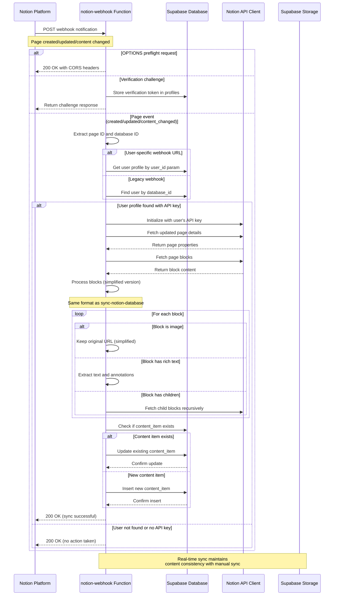
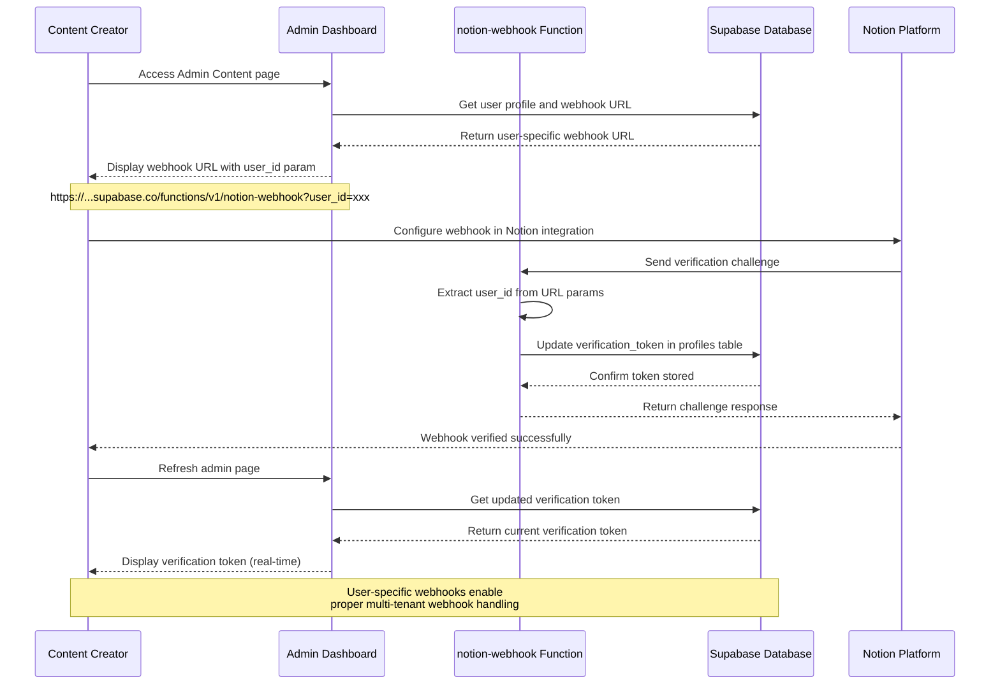

# Vista Platform - Sequence Diagrams

This document contains detailed sequence diagrams for the main functional flows in the Vista platform, supporting the Document-driven Test-driven Development (DTDD) approach.

## 1. Notion Content Synchronization Flow

## 2. Real-time Content Updates via Webhooks (Updated)

## 3. Webhook Setup and Verification Flow (New)

## 4. Content Personalization and Recommendation Engine

## 5. Multi-language Content Translation Flow

## 6. Real-time Analytics and Performance Tracking

## 7. Media Processing and Display

## Key Design Principles

### Error Handling Strategy
- Graceful degradation for external service failures
- Comprehensive logging for debugging and monitoring
- User-friendly error messages with actionable guidance
- Automatic retry mechanisms for transient failures

### Performance Optimization
- Lazy loading for content and media
- Efficient vector similarity searches with indexing
- Caching strategies for frequently accessed content
- Asynchronous processing for non-critical operations

### Privacy and Compliance
- Explicit user consent for all data collection
- No third-party tracking or cookies
- GDPR/CCPA compliant data handling
- User control over personalization preferences

### Scalability Considerations
- Horizontal scaling for high-traffic scenarios
- Efficient database queries with proper indexing
- CDN integration for global content delivery
- Microservice architecture for independent scaling

### Webhook Content Synchronization
- Real-time sync maintains same data format as manual sync
- User-specific webhooks enable proper multi-tenant handling
- Simplified content processing for webhook performance
- Consistent error handling across sync methods
